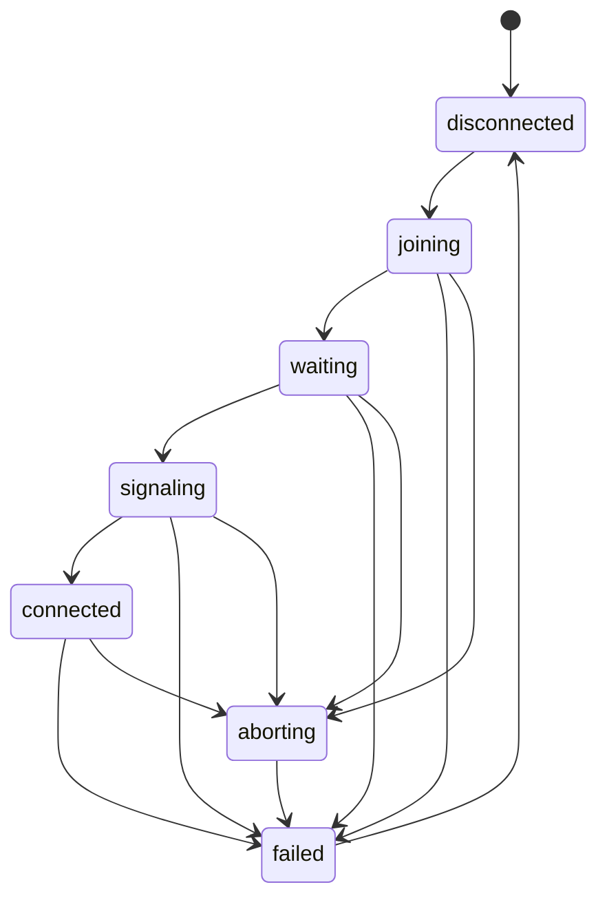

# Contributing Guide

> This document describes the technical architecture and design philosophy behind the project, helping future developers understand, extend, and maintain the codebase.

---

# Table of Contents

- [Development Guide](#development-guide)
- [Application Architecture](#application-architecture)
- [Module Collaboration Pattern](#module-collaboration-pattern)
- [Core Module: Adapter](#core-module-adapter)
- [Core Module: Transport](#core-module-transport)

---

# Development Guide

## Prerequisites

Before you begin, ensure your system has the following tools installed:

- **Node.js**: v22.x or later (LTS recommended)
- **npm**: v11.x or later (bundled with Node.js)
- **Git**: For version control

## Getting Started

### 1. Clone the Repository

```bash
git clone https://github.com/1ureka/1ureka.net.p2p.git
cd 1ureka.net.p2p
```

### 2. Install Dependencies

```bash
npm install
```

### 3. Start Development Server

```bash
npm start
```

This runs `electron-forge start`, which launches:

- Vite development server with HMR (Hot Module Replacement)
- Electron main process
- Electron renderer process

## Testing

The project uses an **end-to-end testing strategy**, validating complete data flows through the system.

**Test Coverage**:

- Adapter packet encoding/decoding
- Chunking/Reassembly logic
- Multiple concurrent connections
- Large data transfer stability
- Out-of-order delivery simulation
- Scenarios with multiple mappings

### Run All Tests

```bash
npm test
```

### Run a Specific Test File

```bash
npx vitest run src/adapter/adapter.test.ts
```

## Building & Releasing

### Local Build

```bash
npm run package
```

This uses Electron Forge to package the application to a portable executable folder in the `out/` directory.

### Clean Build Artifacts

```bash
npm run clean
```

This removes `out/`, `.vite/`, `dist/` directories.

### Release Workflow

The project uses **GitHub Actions** for automated releases. Currently supports Windows platform:

**Trigger a Release**:

1. Go to the `Actions` tab on GitHub
2. Select the `Release (Windows)` workflow
3. Click `Run workflow`
4. Enter version number (e.g., `v1.0.0-alpha.n`)
5. Confirm execution

**Release Artifacts**:

- Filename: `1ureka.net.p2p-win32-x64-{version}.zip`
- Contents: Windows x64 executable and related resources
- Location: GitHub Releases page

---

# Application Architecture

The project is built on **Electron**, leveraging its dual-process architecture to layer network processing:

```
┌─────────────────────────────────────────────────────────────────┐
│                         Electron App                            │
├─────────────────────────────────┬───────────────────────────────┤
│        Renderer Process         │        Main Process           │
│   (Web Technologies: React)     │   (Node.js Runtime)           │
├─────────────────────────────────┼───────────────────────────────┤
│  Transport Module               │  Adapter Module               │
│  • WebRTC Peer Connection       │  • TCP Socket Management      │
│  • Signaling (HTTP API)         │  • Protocol Conversion        │
│  • DataChannel Management       │  • Packet Framing             │
│  • State Machine                │  • Rules & Mappings           │
└─────────────────────────────────┴───────────────────────────────┘
                    │                           │
                    └─────────── IPC ───────────┘
                         (Electron)
```

## Why Two Processes?

This isn't just an Electron requirement—it's a deliberate design choice based on **separation of concerns**:

- **Transport Module (Renderer Process)**
  - **Role**: Establishes and maintains peer-to-peer connections.
  - **Responsibilities**:
    - Exchanges connection info (SDP, ICE candidates) via signaling server.
    - Manages RTCPeerConnection lifecycle.
    - Provides a single RTCDataChannel as the data transport pipeline.
  - **Why Renderer**: WebRTC APIs are native to browser environments. Electron's renderer process offers direct access to the full WebRTC stack.

- **Adapter Module (Main Process)**
  - **Role**: Translates between TCP protocol and WebRTC DataChannel.
  - **Responsibilities**:
    - Creates and manages local TCP socket connections.
    - Implements custom packet protocol for multiplexing.
    - Executes role-specific logic (Host/Client).
  - **Why Main**: Node.js's `net` module provides full TCP socket control, and the main process has better system resource management.

---

# Module Collaboration Pattern

The project follows a **declarative, unidirectional data flow** architecture, ensuring clarity and traceability in state management.

## Core Concepts

Every module (Adapter, Transport) follows this structure:

```
module-state/
 ┣ store.ts       Single source of truth
 ┣ report.ts      Internal → External state propagation
 ┗ handlers.ts    External → Internal intent processing
```

### 1. Store (Declare Where is the Source)

- **Role**: The single source of truth for module state.
- **Characteristics**:
  - **Read-only** for UI and other modules.
  - Should provide a subscription mechanism so UI, CLI, or even other modules can react to state changes.
  - In this project, implemented via Zustand, allowing UI to subscribe via hooks.

### 2. Report (Declare How It Changes)

- **Role**: A channel for propagating state changes and events from inside the module to the outside, called by core logic or handlers.
- **Direction**: Internal → External (unidirectional).
- **Responsibilities**:
  - Log events (info / warn / error).
  - Update state in the store.
  - Transform raw data into store types.

### 3. Handlers (Declare Intent)

- **Role**: Receives external intents (user actions, requests from other modules) and translates them into internal logic.
- **Direction**: External → Internal (unidirectional).
- **Responsibilities**:
  - Coordinate execution of internal module logic.
  - Can also report execution results back via report.

## Examples

### Transport Implementation (Single Process)

```typescript
// store.ts (Renderer Process)
const useSession = create<SessionState>(() => ({
  role: "host",
  status: "disconnected",
  history: [],
  // ... initialization or declare where is the source
}));

// report.ts (Renderer Process)
const reportStatus = (status: ConnectionStatus): boolean => {
  const { status: current } = useSession.getState();

  if (!validTransitions[current].includes(status)) {
    reportError({ message: `Invalid transition from ${current} to ${status}` });
    return false;
  }

  useSession.setState({ status });
  return true;
};

// handlers.ts (Renderer Process)
const handleCreateSession = () => {
  reportRole("host");
  createHostSession(); // Triggers core logic, which will report other states via report.ts
};

const handleStop = () => {
  if (!reportStatus("aborting")) return; // Validate transition; success affects logic listening to this state
  reportWarn({ message: "Stop requested by user" });
};
```

### Adapter Implementation (Dual Process)

```typescript
// store.ts (Renderer Process)
const useAdapter = create<AdapterState>((set) => {
  // declare where is the source, in this case, IPC from main process
  window.electron.on(IPCChannel.AdapterInstanceChange, ({ instance }) => {
    set({ instance });
  });
  // ...
});

// report.ts (Main Process)
const reportInstance = (props: InstanceChangePayload) => {
  const win = getWindow();
  // Send to renderer via IPC
  win.webContents.send(IPCChannel.AdapterInstanceChange, props);
};

// core.ts (Main Process)
ipcMain.handle(IPCChannel.AdapterStartHost, () => {
  startAdapterService("host");
  reportInstance({ instance: "host" });
});

// handlers.ts (Renderer Process)
const handleStartHostAdapter = async () => {
  // Send to main process via IPC
  const success = await window.electron.request(IPCChannel.AdapterStartHost);
  if (!success) throw new Error("Failed to start host adapter");
};
```

### HTTP Implementation (For Illustration Only)

```typescript
// store.ts
const usePostsStore = create<PostsState>(() => ({
  posts: [],
  postsLoading: false,
  postsError: null,
}));

// report.ts
const reportPosts = (data: any) => {
  const posts = PostEntrySchema.array().parse(data);
  usePostsStore.setState({ posts, postsLoading: false, postsError: null });
};
const reportPostsError = (error: Error) => {
  usePostsStore.setState({ postsLoading: false, postsError: error.message });
};
const reportPostsLoading = () => {
  usePostsStore.setState({ postsLoading: true, postsError: null });
};

// core.ts
const fetchPosts = async () => {
  reportPostsLoading();
  try {
    const response = await fetch("https://example.com/posts");
    if (!response.ok) throw new Error(`HTTP error! status: ${response.status}`);
    const data = await response.json();
    reportPosts(data);
  } catch (error) {
    reportPostsError(error as Error);
  }
};

// handlers.ts
const handleLoadPosts = async () => {
  await fetchPosts();
};
```

## Advantages

1. **Unidirectional Data Flow**: State changes follow a clear path, making debugging and tracing straightforward.
2. **Separation of Concerns**: State storage, event propagation, and intent handling each have distinct responsibilities.
3. **Environment-Agnostic**: The design works regardless of the runtime environment—single process, dual process, or even distributed systems.

From a UI perspective, this design truly achieves `UI = f(state)`. The UI doesn't need to know where state comes from or how it changes—it just renders what it receives.

Before: Logic scattered in UI

```typescript
const [loading, setLoading] = useState(false);
const [error, setError] = useState(null);
const [data, setData] = useState([]);

useEffect(() => {
  setLoading(true);
  fetch("/api/posts")
    .then((res) => res.json())
    .then(setData)
    .catch(setError)
    .finally(() => setLoading(false));
}, []);
```

After: UI as a pure function

```tsx
import { usePostsStore } from "@/modules/posts/store";
import { handleLoadPosts } from "@/modules/posts/handlers";

export function PostList() {
  const { posts, postsLoading, postsError } = usePostsStore();

  if (!posts && !postsLoading && !postsError) return <PostsButton onClick={handleLoadPosts} />;
  if (postsLoading) return <Spinner />;
  if (postsError) return <ErrorBox message={postsError} onRetry={handleLoadPosts} />;
  return <PostCards posts={posts} />;
}
```

---

# Core Module: Adapter

The Adapter is the **heart of protocol translation**, converting TCP connections into packets suitable for transmission over WebRTC DataChannel.

## Why Do We Need an Adapter?

### The Nature of TCP

- **TCP is a bidirectional stream protocol**, where each connection is an independent socket.
- Applications can open multiple TCP sockets simultaneously, even to the same service.
- Examples:
  - Browsers create multiple TCP connections to download resources in parallel (HTML, CSS, JS, images).
  - Database connection pools maintain multiple connections to the same database.
  - Vite dev servers handle short-lived static asset requests alongside long-lived HMR connections.

### WebRTC DataChannel Limitations

- DataChannel is built on **SCTP over DTLS over UDP**, making it fundamentally **message-oriented**.
- Each DataChannel maps to a single SCTP stream, with size limits on individual messages.
- To emulate TCP over DataChannel, we need additional layers:
  - **Multiplexing**: Share one DataChannel among multiple logical TCP sockets.
  - **Chunking/Reassembly**: Split TCP streams into manageable chunks and reassemble them on the other side.

**The Adapter's role** is to turn a DataChannel into a "virtual wire" capable of carrying multiple TCP sockets.

## Logical Sockets

The Adapter uses **Socket Pairs as identifiers** combined with event packets to multiplex multiple logical TCP connections over a single DataChannel.

### Socket Pair as Identifier

```typescript
type SocketPair = {
  srcAddr: string; // Client-side application source IP
  srcPort: number; // Dynamically assigned port by OS on client
  dstAddr: string; // Target service IP on host
  dstPort: number; // Target service port on host
};
```

- **One Socket Pair = One TCP connection**.
- `srcAddr/srcPort` ensures uniqueness for each connection, while `dstAddr/dstPort` lets the host identify the target service.
- All `CONNECT`, `DATA`, and `CLOSE` packets related to this connection use the same identifier.

### Lifecycle

```
┌──────────────────────────────────────────────────────────────┐
│  CONNECT   Client generates Socket Pair → Sends CONNECT      │
│            → Host creates corresponding TCP socket           │
├──────────────────────────────────────────────────────────────┤
│  DATA      Both sides send/receive via Chunker/Reassembler   │
├──────────────────────────────────────────────────────────────┤
│  CLOSE     Either side errors or closes → Sends CLOSE packet │
│            → Peer releases resources                         │
└──────────────────────────────────────────────────────────────┘
```

## Protocol Design

The project implements a custom application-layer protocol for multiplexing TCP connections over DataChannel.

### Packet Structure

| Offset  | Size | Field        | Type      | Description                                 |
| ------- | ---- | ------------ | --------- | ------------------------------------------- |
| [0]     | 1    | event        | Uint8     | Event type (`CONNECT`, `DATA`, `CLOSE`)     |
| [1–16]  | 16   | src_addr     | Uint8[16] | Source IP (IPv4 mapped to IPv6 format)      |
| [17–18] | 2    | src_port     | Uint16    | Source port                                 |
| [19–34] | 16   | dst_addr     | Uint8[16] | Destination IP (IPv4 mapped to IPv6 format) |
| [35–36] | 2    | dst_port     | Uint16    | Destination port                            |
| [37–38] | 2    | stream_seq   | Uint16    | Stream sequence (for circular allocation)   |
| [39–40] | 2    | chunk_index  | Uint16    | Index of this chunk in the stream           |
| [41–42] | 2    | total_chunks | Uint16    | Total chunks in this stream                 |
| [43– ]  | N    | payload      | Uint8[]   | Actual TCP data                             |

### Circular Allocation

- `stream_seq` **must be implemented with circular reuse**.
- Max value is 65535; when reached, wraps back to 0.
- Incomplete `stream_seq` values must not be overwritten—implementations should ensure safe recycling.
- This allows up to 65535 concurrent incomplete messages.

## Role Implementations

### Host Adapter

- **Responsibility**: Accept connection requests from client, create corresponding local TCP sockets.
- **Workflow**:
  1. Receive `CONNECT` packet → Parse target address and port.
  2. Validate against rules → Confirm if connection is allowed.
  3. Create TCP socket → Connect to local service.
  4. Forward `DATA` packets → TCP socket ⇆ DataChannel.
  5. Handle `CLOSE` packet → Release resources.

### Client Adapter

- **Responsibility**: Create virtual TCP server, intercept local application connection requests.
- **Workflow**:
  1. Create `net.Server` based on mappings.
  2. Local app connects → Generate Socket Pair → Send `CONNECT` packet.
  3. Forward `DATA` packets → TCP socket ⇆ DataChannel.
  4. Handle `CLOSE` packet → Release resources.

---

# Core Module: Transport

The Transport module is the **foundation of P2P connectivity**, built on WebRTC to establish and maintain peer-to-peer connections.

## Why WebRTC?

While Node.js/Electron can establish direct TCP/UDP connections, this often fails behind **NAT / firewalls**.

WebRTC advantages:

- **NAT Traversal**: Built-in ICE (STUN/TURN) mechanisms establish direct connections across diverse network environments.
- **Reliability**: DataChannel is built on SCTP over DTLS over UDP, providing retransmission, ordering, and fragmentation.
- **Security**: All data is encrypted via DTLS, preventing man-in-the-middle attacks.

However, WebRTC's API can be cumbersome:

- Requires exchanging SDP offer/answer and ICE candidates.
- Must properly initialize DataChannel and monitor its state.

The project wraps this complexity in a simplified API, ensuring clean lifecycle management.

## Encapsulation & Extensibility

### Simple API Surface

The project uses a **Vanilla ICE flow**, binding RTCPeerConnection and RTCDataChannel to the same lifecycle:

```typescript
const { getDataChannel, getLocal, setRemote, close } = createPeerConnection();
```

**Why this design?**

- The project doesn't need multiple DataChannels or media streams.
- It only needs **one reliable data channel** to carry TCP packets.
- Initialization happens upfront, so upper layers can focus on role-specific workflows.

### Plugin-Based Extension

To avoid tight coupling with WebRTC APIs, the project uses a **plugin-based binding** approach:

```typescript
const dataChannel = await getDataChannel(timeout);
bindDataChannelIPC(dataChannel); // Bridge to main process
bindDataChannelTraffic(dataChannel); // Monitor bandwidth
```

**Plugin Contract**:

- **Self-Contained**: Each plugin manages its own lifecycle—registration and cleanup.
- **Auto-Cleanup**: Plugins listen to `onclose`/`onerror` events to automatically unregister.
- **No Framework Burden**: The core framework doesn't need to know about plugin internals.

This design is inspired by **Blender's addon system**: plugins have `register/unregister`, and the host app doesn't manage their cleanup.

## Signaling Strategy

To establish a P2P connection, both peers must exchange connection information (SDP descriptions and ICE candidates).

The project uses a **session-based HTTP signaling server** with long polling:

### Signaling Flow

```
1. Host creates session          →   Receives Session ID
2. Host waits for client to join →   Long polling for join event
2. Client joins with ID          →   Waits for WebRTC negotiation
3. Both exchange SDP & ICE       →   Long polling for peer signals
4. WebRTC connection opens       →   Signaling complete
```

### Design Decisions

- **Long Polling**: Client polls for peer signals with server-side timeout (5s) and client-side retry (100ms).
- **Stateless Design**: Server stores no sensitive data — only helps exchange public connection info.
- **Single-Use Sessions**: Each Session ID is valid for one connection only; must create new session after disconnect.
- **Auto Cleanup**: Redis TTL automatically cleans up expired sessions.

## Lifecycle Management

The Transport module uses a **finite state machine (FSM)** to manage connection lifecycle:



**Key States**:

- **disconnected**: Initial state, no connection.
- **joining**: Creating or joining a session.
- **waiting**: Host waiting for client to join.
- **signaling**: Exchanging SDP and ICE candidates via signaling server.
- **connected**: DataChannel successfully opened, ready for data transfer.
- **aborting**: User requested stop, cleaning up resources.
- **failed**: Connection failed or stopped, ready to retry.

> [!TIP]
> For Client, Waiting state still occurs but only momentarily to ensure proper state transition.

**State Validation**:

The FSM enforces valid state transitions to prevent invalid operations:

```typescript
const validTransitions: Record<ConnectionStatus, ConnectionStatus[]> = {
  disconnected: ["joining"],
  joining: ["waiting", "failed", "aborting"],
  waiting: ["signaling", "failed", "aborting"],
  signaling: ["connected", "failed", "aborting"],
  connected: ["failed", "aborting"],
  aborting: ["failed"],
  failed: ["disconnected"],
};
```

Any invalid transition is rejected and logged for debugging.

## Session Concept

In this project, a **Session** represents the **complete P2P connection entity**, including both Transport and Adapter:

```
Session = Transport (WebRTC DataChannel) + Adapter (TCP Sockets)
```

**Session Lifecycle**:

1. **Create/Join**: User initiates session creation (Host) or joins existing session (Client).
2. **Establish Transport**: WebRTC negotiation completes, DataChannel opens.
3. **Start Adapter**: Main process creates Host/Client adapter, binds to DataChannel via IPC.
4. **Active**: TCP sockets can now be created and data flows through the system.
5. **Teardown**: User stops connection → Adapter closes TCP sockets → Transport closes DataChannel.

The UI's "Session Card" reflects this unified concept—displaying both Transport status and Adapter status together.

---

# Closing Thoughts

This document describes the project's core technical architecture, including dual-process design, module collaboration patterns, and implementation details of the Adapter and Transport modules.

We hope this guide helps future maintainers quickly understand the project structure and build upon it with confidence.

If you have questions or suggestions, feel free to open an Issue or Pull Request.
