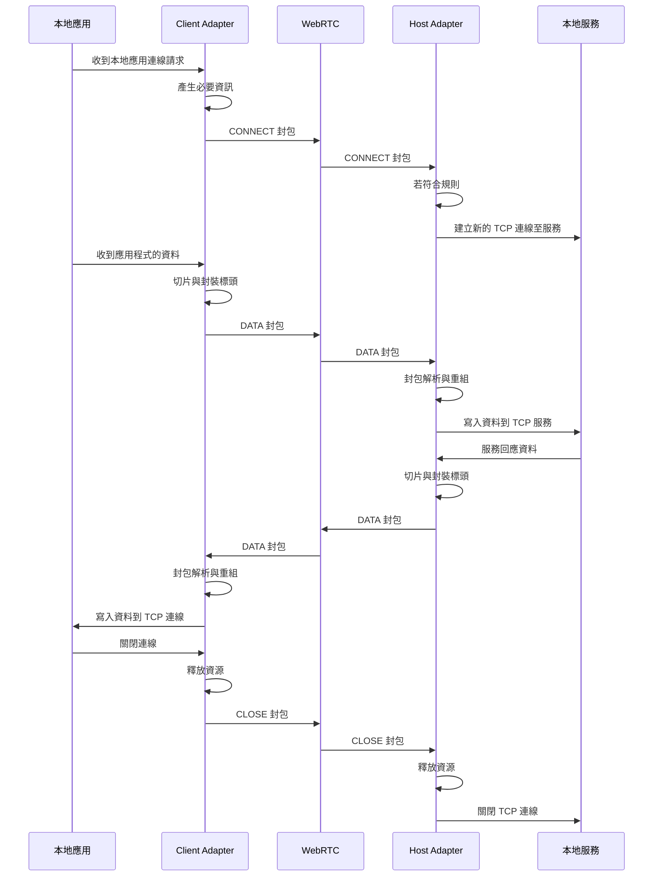

# 1ureka.net.p2p

> [!IMPORTANT]
> **一個能讓你把任意 TCP 服務透過 WebRTC 分享給遠端的桌面工具。**

我相信網路應該是自由的 ——
不該因為沒有固定 IP、沒有設定 Port Forwarding，或是不想付費買代理服務、租用伺服器，就失去分享與連線的可能性。

## 你能用它做什麼？

- 與朋友分享 **Minecraft Dedicated Server** 或任何基於 TCP 的遊戲伺服器。
- 遠端存取 **本地 HTTP/HTTPS 服務**（例如測試網站、API）。
- 讓團隊連線到 **本地工具服務**（如本地大語言模型、協作插件）。
- 直通遠端內網的其他機器與資源（如資料庫、NAS、內部網站）。
- 將一端當作 **跨區 VPN 節點**，幫助另一端繞過地區或網路限制。
- 反向代理：讓一端的內網服務能透過另一端的外網端口公開。

## 為什麼沒有流量限制或付費方案？

因為這不是商業代理服務，而是基於 **開放技術** 開發的工具：

- **Electron**：跨平台桌面環境，免安裝網路驅動或修改系統設定。
- **WebRTC**：內建 NAT 穿透與端對端加密，確保傳輸安全並能直接連線。
- **Node.js 的 `net` 模組**：負責 TCP socket 的建立與轉發，支援所有 TCP 協定。

這些基礎技術本身就是自由、開放的，因此 **沒有額外流量限制，也不需要收費**。

## 與 VPN 或代理的不同

- **不會接管整個網路**：只針對你指定的 TCP 服務轉發，不會像 VPN 一樣強制改道所有流量。
- **不依賴中心化伺服器**：資料傳輸是雙方電腦直接連線，伺服器只在連線建立過程中用來交換必要的連線資訊。
- **沒有隱藏門檻**：不必綁定信用卡、不會遇到「免費額度用完」這種設計。

---

# 如何使用？

## 網路需求

只要你的網路能正常進行 **線上遊戲** 或 **視訊通話**，就能使用本工具。

- **最常見且穩定的情況**
  - 家用光纖或寬頻網路 (Wi-Fi)
  - 手機行動熱點（4G / 5G）
  - 學校或公司具備對外 IP 的網路

- **可能較難使用的情況**
  - 公用 Wi-Fi（咖啡廳、旅館等，通常會封鎖連線）
  - 同一區域網路下的兩台設備（例如同一 Wi-Fi 或行動熱點）
  - 嚴格管制的公司防火牆

## 下載與啟動

1. 前往 [Releases 頁面](https://github.com/1ureka/1ureka.net.p2p/releases)下載最新的 **zip 壓縮檔**。
2. 解壓縮後，資料夾內會包含一個 **可執行檔** (例如 Windows 是 `*.exe`)。
3. 直接開啟該可執行檔就能啟動應用程式。
   - **所有應用資料**都會存在於解壓縮後的資料夾中，不會寫入系統。
   - 想要**移除應用**，只需刪除整個資料夾即可，無需額外清理。

## 建立連線

如果你不知道該如何選擇，可以先看下方[應用場景](#應用場景)的說明。

| 角色   | 建立 Session                                                                     | 管理方式                                                                                                                                                                                       |
| ------ | -------------------------------------------------------------------------------- | ---------------------------------------------------------------------------------------------------------------------------------------------------------------------------------------------- |
| Host   | 啟動後由信令伺服器產生唯一 **Session ID**，將此 ID 分享給 Client，就能建立會話。 | **規則管理**：<br> • 定義允許存取的 TCP 服務 (例：`127.0.0.1:25565`)<br> • 可用萬用字元 (例：`127.0.0.1:*`)<br> • 多個規則會依序檢查，只要符合其中之一即可<br> • 規則在會話期間可隨時新增/刪除 |
| Client | 從 Host 取得 **Session ID**，送出加入請求並經 Host 同意後，Session 即建立完成。  | **映射表管理**：<br> • 定義「本地端口 => 遠端服務」(例：`localhost:25565 => 127.0.0.1:25565`)<br> • 若端口衝突需更換<br> • 映射在會話期間可隨時新增/刪除                                       |

## 應用場景

### 使用遠端本地服務

Client 能直接使用 Host 分享出來的服務，就像在自己電腦上一樣。

| 範例             | Host 規則         | Client 映射                          | 最終效果                                  |
| ---------------- | ----------------- | ------------------------------------ | ----------------------------------------- |
| Minecraft 伺服器 | `127.0.0.1:25565` | `localhost:25565 => 127.0.0.1:25565` | Client 能直接連進 Host 的遊戲伺服器       |
| 本地 API / 工具  | `127.0.0.1:3000`  | `localhost:3000 => 127.0.0.1:3000`   | Client 能使用 Host 的 LLM API、測試網站等 |

### 使用遠端內網服務

如果 Host 開放區網位址（如 `192.168.*`），Client 就能直通 Host 內部網路的其他設備。

| 範例         | Host 規則     | Client 映射                            | 最終效果                                             |
| ------------ | ------------- | -------------------------------------- | ---------------------------------------------------- |
| 資料庫 / NAS | `192.168.*:*` | `localhost:3000 => 192.168.20.14:3000` | Client 連到本地 3000，實際就是 Host 區網內的其他裝置 |

### 使用遠端作為跨區 VPN

如果 Host 規則允許 `*:*`，Client 就能透過 Host 轉發任意 TCP 連線，效果類似 VPN 節點。

| 範例         | Host 規則 | Client 映射                        | 最終效果                                      |
| ------------ | --------- | ---------------------------------- | --------------------------------------------- |
| 跨區訪問網站 | `*:*`     | `localhost:443 => example.com:443` | Client 的連線由 Host 代為發出，可繞過地區限制 |

### 反向代理模式

如果 Client 本身在外網，Host 在內網，就能透過映射把 Host 的服務「掛到」 Client 的外網端口。

| 範例         | Host 規則        | Client 映射                       | 最終效果                                            |
| ------------ | ---------------- | --------------------------------- | --------------------------------------------------- |
| 對外開放 API | `127.0.0.1:8080` | `localhost:443 => localhost:8080` | 全世界的人連 Client 的 443，就等於訪問 Host 的 8080 |

> [!TIP]
> 不論是「直通內網」「VPN 跨區」或「反向代理」，所有傳輸仍然是 **端對端加密的 P2P WebRTC 連線**，不經過第三方伺服器。

## 斷線與資源管理

- 若想中斷連線，**只需關閉應用程式**。
- 所有的 Session、TCP 連線與資源都會隨應用程式進程釋放，不會殘留任何背景程序或隱藏服務。

---

# 應用架構

專案利用了 Electron 的 **雙進程架構**，各自負責不同的網路層級處理：

- **Transport 模組（渲染進程）**
  專注於 P2P 連線的建立與維護，處理信令交換、ICE 候選收集，以及資料在 DataChannel 上的傳遞。
  可以將它視為「通往遠端的網路管道」。

- **Adapter 模組（主進程）**
  將 TCP 協定轉換成可在 WebRTC DataChannel 上傳輸的格式，並透過 Electron 的 IPC 與 Transport 模組協同工作。
  可以將它視為「銜接本地應用程式與網路管道的接口」。

這兩個模組互相合作，使得本地 TCP 服務能透過 P2P 的方式被另一端直接存取。

## 流程圖

以下流程圖展示了 TCP 資料如何透過本系統進行傳輸：



---

# 核心模組：Adapter

Adapter 是應用的 **核心轉換模組**，根據不同角色的需求，分為：

- **Host**
  負責在 Client 要求時建立對應的本地 TCP 連線

- **Client**
  負責攔截本地應用的 TCP 連線需求，使本地應用認為自己直接連上實際服務。

## 為什麼需要 Adapter？

要理解 Adapter 的存在，必須先理解 **TCP socket 的本質**：

- **TCP 是雙向的資料流協定**。
  - 每建立一次連線，就會創造一個獨立的 **socket 實體**，用來維護連線狀態（序號、緩衝、重傳、關閉等）。
  - 一個應用程式可以同時開啟許多 TCP socket，例如：
    - 瀏覽器同時載入多張圖片、JS、CSS。
    - 資料庫連線池 (connection pool) 中的多條 TCP 連線，同樣指向同一個 DB 服務與 port。
    - Vite 開發伺服器 (一個前端常用的網站開發工具) 會同時出現短生命的靜態資源請求與長生命的 HMR 連線。

- **WebRTC DataChannel 的限制**
  - DataChannel 底層基於 **SCTP over DTLS over UDP**，本質上是 **訊息導向** 的，而非 TCP 那樣的連續位元流。
  - 每條 DataChannel 對應一個 SCTP stream，單個訊息大小有限制。
  - 因此在 DataChannel 上要模擬 TCP，必須有額外層：
    - **多工 (Multiplexing)**：讓多個邏輯 TCP socket 共用同一條 DataChannel。
    - **流式重組 (Chunker/Reassembler)**：將 TCP 的資料流切片到合適的大小再拼回來。

**Adapter 的角色**，就是為了將 DataChannel 變成一個「可承載多個 TCP socket 的虛擬線路」。

## 邏輯 Socket

Adapter 透過自訂協定中的 **識別碼與事件封包** 將單一 DataChannel 切分為多條邏輯 TCP 連線：

- **一個識別碼 = 一條 TCP 連線**
  - 識別碼實際上就是 TCP Socket Pair
  - 所有與此連線相關的 `CONNECT`、`DATA`、`CLOSE` 封包，都會使用相同的識別碼。

- **生命週期**
  - **建立 (CONNECT)**
    - Client 接收到本地 TCP 請求 → 產生識別碼 → 發送 `CONNECT` 封包 → Host 建立新的 TCP socket。
  - **傳輸 (DATA)**
    - 雙方透過 Chunker / Reassembler 傳送與接收資料。
  - **關閉 (CLOSE)**
    - 任一端發生錯誤或主動關閉 → 發送 `CLOSE` 封包 → 對端釋放資源。

> [!TIP]
> 邏輯 socket 在 Adapter 裡是一個「狀態機」，對應到真實 TCP socket 的生命周期。

## 協定設計

在 Adapter 的多工架構下，需要一個自訂協定，確保 **多連線、多訊息、多片段** 都能正確傳輸。

### 封包結構

| Offset  | Size | Field        | Type      | 說明                                  |
| ------- | ---- | ------------ | --------- | ------------------------------------- |
| [0]     | 1    | event        | Uint8     | 事件型別 (`CONNECT`, `DATA`, `CLOSE`) |
| [1–16]  | 16   | src_addr     | Uint8[16] | 來源 IP 位址 (IPv4 映射成 IPv6 格式)  |
| [17–18] | 2    | src_port     | Uint16    | 來源 Port                             |
| [19–34] | 16   | dst_addr     | Uint8[16] | 目標 IP 位址 (IPv4 映射成 IPv6 格式)  |
| [35–36] | 2    | dst_port     | Uint16    | 目標 Port                             |
| [37–38] | 2    | chunk_id     | Uint16    | 資料流片段 ID                         |
| [39–40] | 2    | chunk_index  | Uint16    | 本片段在訊息中的序號                  |
| [41–42] | 2    | total_chunks | Uint16    | 總片段數                              |
| [43–44] | 2    | payload_size | Uint16    | 本片段資料大小                        |
| [45– ]  | N    | payload      | Uint8[]   | 真正的 TCP 資料                       |

### 補充說明

- **payload_size 的設計**
  - DataChannel 單次訊息的實務上限約 **65535 bytes**。
  - 扣除協定 header 的 **45 bytes**，最大 payload 剛好是 **65490 bytes**。
  - 這確保 `payload_size` 可以完全由 `Uint16` 表示，無需額外擴展。

- **循環使用**
  - `chunk_id` **MUST 實作循環使用**。
  - 上限皆為 65535，當編號達到最大值後，必須回到 0 重新分配。
  - 任何尚未完成的 chunk_id 不得被覆寫，實作方 SHOULD 確保安全回收。
  - 因此該協定能支撐同時多達 65535 個未完成的訊息。

---

# 核心模組：Transport

Transport 模組是該專案的 **P2P 實現基礎**，以 WebRTC 為核心，負責：

1. 建立並維護 **Peer-to-Peer 連線**。
2. 提供唯一的 **RTCDataChannel** 作為 TCP 隧道的承載管道。
3. 對外封裝為簡單的 **Session API**，確保生命週期清晰。
4. 提供 **插件式擴展**，用於資料轉發、監控或統計。

## 為什麼選擇 WebRTC？

雖然 Node.js/Electron 中也可以透過 TCP/UDP 直連，但在 **NAT/防火牆** 環境下往往不可行。WebRTC 的出現，正好解決了這個問題：

- **NAT Traversal**：WebRTC 內建 ICE (STUN) 機制，能在不同網路環境下盡可能建立直連。
- **可靠性**：DataChannel 基於 **SCTP over DTLS over UDP**，具備重傳、順序保證、分片處理等功能。
- **安全性**：所有資料皆透過 DTLS 加密，避免中途攔截。

但同時 WebRTC 的 API 相對繁瑣：

- 建立連線需要 SDP offer/answer、ICE candidates 的交換。
- 必須正確初始化 DataChannel，並監控其狀態。

因此，專案內封裝了一層 API，確保初始化、生命週期管理的簡單性。

## API 設計

專案採用 **Vanilla ICE 流程**，並將 **RTCPeerConnection** 與 **RTCDataChannel** 綁定在同一個生命週期。

這樣做的原因是：

- 專案並不是要實作完整的 RTC 應用（例如多媒體傳輸、多條 DataChannel）。
- 專案只需要 **一條穩定的資料通道** 來承載 TCP 封包。

```ts
const { getDataChannel, getLocal, setRemote, close } = createPeerConnection();
```

> [!TIP]
> 這層封裝會在一開始就初始化 **RTCDataChannel** 與 **ICE Candidate 收集**。
> 上層只需要專注於角色（Host/Client）的流程。

## 插件式綁定

為了避免 WebRTC API 過於耦合，專案採用「插件式綁定」的方式，常見的操作如 **DataChannel ↔ IPC 綁定**、**監控流量**、**記錄監控資訊**，都可以被抽象為「插件」。
為了確保生命週期清晰，每個 `bindDataChannelX` 函數必須遵循以下規範：

- **自給自足**：
  呼叫 `bindDataChannelX(...)` 即表示完成了該插件的整個註冊過程。呼叫者無需額外呼叫 `unregister` 或 `close`。
- **責任範圍**：
  - `register` → 在 `onmessage`、`monkey patch send` 等事件中掛載需要的邏輯。
  - `unregister` → 必須在 `onclose` / `onerror` 自動移除監聽器、釋放自己創建的資源。

- **框架保證**：
  核心 `createWebRTCSession` 已經保證整體連線的 **主生命週期**，插件只需管理「自己多出來的部分」。
- **類似 Blender 插件機制**：
  - Blender 規範每個插件必須有 `register/unregister`。
  - 在這裡，`bindDataChannelX` 就是自帶 register/unregister 的函式，應用本身不需要知道如何清理。

### 範例：DataChannel 與 IPC 綁定

```ts
const bindDataChannelIPC = (dataChannel: RTCDataChannel) => {
  const sender = createDataChannelSender(dataChannel);

  // register
  dataChannel.onmessage = (event) => /* ...轉發到 IPC... */;
  const handleIPCMessage = (buffer: unknown) => /* ...轉發到 DataChannel... */;
  window.electron.on(event, handleIPCMessage);

  // unregister
  const cleanup = () => { window.electron.off(event, handleIPCMessage); sender.close(); };
  dataChannel.onclose = cleanup;
  dataChannel.onerror = cleanup;
};
```

### 範例：DataChannel 流量監控

```ts
const bindDataChannelMonitor = (dataChannel, onUpdate) => {
  // register
  dataChannel.onmessage = (e) =>  /* 計算輸入流量 */, onUpdate(...);
  const originalSend = dataChannel.send.bind(dataChannel);
  dataChannel.send = (data) =>  /* 計算輸出流量 */, originalSend(data);

  // unregister
  const cleanup = () => { dataChannel.send = originalSend; /* 移除監聽 */ };
  dataChannel.onclose = cleanup;
  dataChannel.onerror = cleanup;
};
```

## 信令 (Signaling)

為了建立 P2P 連線，兩端必須交換連線資訊（SDP 描述與 ICE 候選）。專案採用基於 **HTTP 的會話式信令伺服器**。

### 會話生命週期

1. **Host 創建會話**
   ```ts
   const session = await createSession(); // 產生唯一的 Session ID
   ```

2. **Client 加入會話**
   ```ts
   const session = await joinSession(sessionId); // 使用 Host 提供的 ID 加入
   ```

3. **信令交換**
   - Host 發送 `offer`（SDP + ICE candidates）
   - Client 接收 `offer` 並發送 `answer`
   - 雙方完成 WebRTC 連線建立

4. **長輪詢機制**
   ```ts
   // 長輪詢等待對方信令，伺服器端 5 秒超時，客戶端 100ms 重試
   for await (const { signal } of pollingSession(id, "offer")) {
     if (signal.offer) {
       await setRemote(signal.offer.sdp, signal.offer.candidate);
       break;
     }
   }
   ```

### 伺服器 API

- `POST /session` - 創建新會話
- `POST /session/{id}` - 加入會話
- `GET /session/{id}?for={event}` - 長輪詢會話狀態
- `PUT /session/{id}/signal` - 發送信令

### 安全性與限制

- **會話 TTL**：伺服器會自動清理過期的會話，避免資源洩漏。
- **無狀態設計**：信令伺服器不儲存任何敏感資料，僅協助交換公開的連線資訊。
- **一次性使用**：每個 Session ID 僅能用於單次連線建立，連線斷開後需重新創建。
