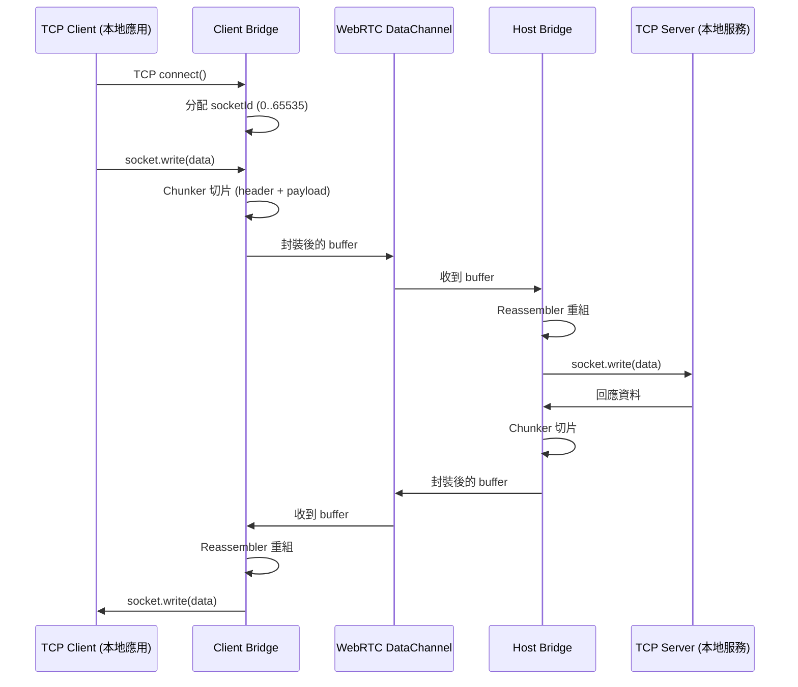

# 1ureka.net.p2p

這是一個基於 Electron 的桌面應用程式，能將 **TCP socket 與 WebRTC DataChannel** 做橋接，讓 **任何基於 TCP 的服務** 都能進行真正的點對點通訊。

> **只要協定建立在 TCP 之上，就能透過本工具進行 P2P 傳輸。**

因為工具專注在 TCP 層，不干涉更上層的協定，因此支援各種基於 TCP 的協定，無論是 **多 socket 協定、server-first / client-first 連線、HTTP/HTTPS、WebSocket (ws/wss)，甚至 各種遊戲或自訂協定**。

---

# 如何使用？

## 下載與啟動

1. 前往 Releases 頁面下載最新的 **zip 壓縮檔**。
2. 解壓縮後，資料夾內會包含 `1ureka.net.p2p.exe`。
3. 直接雙擊 `1ureka.net.p2p.exe` 就能啟動應用程式。
   - **所有應用資料（設定、快取、Session 資訊）**都會存在於解壓縮後的資料夾中，不會寫入系統。
   - 想要**移除應用**，只需刪除整個資料夾即可，無需額外清理。

## 選擇 Host 或 Client

啟動應用後，首先需要選擇角色：

- **Host 模式**
  - 適用於你要「分享服務」的情境，例如：
    - Minecraft Dedicated Server
    - 本地大語言模型服務 (比如 [ollama](https://github.com/ollama/ollama))
    - 本地協作工具服務 (比如 [Blender Mixer Addon](https://ubisoft-mixer.readthedocs.io/en/latest/index.html))

  - 你需要填寫：
    - **轉發端口**：本地 TCP 服務正在監聽的端口（例：`25565` for Minecraft）。
    - **IP 類型**：通常選擇 `127.0.0.1` 或 `::1` 即可。

  - 建立成功後，會生成一個唯一的 **Session ID**。
    - 將此 ID 分享給遠端的 Client（僅限一位）。

- **Client 模式**
  - 適用於你要「使用遠端服務」的情境，例如：
    - Minecraft Client
    - 在命令行寄送請求到遠端的本地大語言模型服務
    - 在協作工具中設置 localhost 連線

  - 你需要填寫：
    - **Session ID**：向 Host 索取並填入。
    - **Port**：指定一個本地端口（例：`25565`），應用程式會連線到此端口，實際會透過 WebRTC 傳送到 Host。

  - 送出 Join 請求後，若 Host 同意，Session 即建立完成。

## 斷線與資源管理

- 若想中斷連線，**只需關閉應用程式**。
- 所有的 Session、TCP 連線與資源都會隨應用程式進程釋放，不會殘留任何背景程序或隱藏服務。

## 一對多

1ureka.net.p2p 的 Session 本質是一對一設計，但若要達到 **一個 Host 同時服務多個 Client**，可以：

1. 在 Host 端 **同時開啟多個應用實例**，每個實例綁定相同的 TCP 服務端口。
2. 每個實例會生成不同的 Session ID，分別提供給不同的 Client。

---

# 應用架構

本工具採用 **雙進程架構**，透過 Electron 的 IPC 機制實現 TCP 與 WebRTC 之間的數據橋接，各自負責不同的網路層級處理：

- **WebRTC 模組（渲染進程）**
  專注於 P2P 連線的建立與維護，處理信令交換、ICE 候選收集，以及資料在 DataChannel 上的傳遞。
  可以將它視為「通往遠端的網路管道」。

- **Bridge 模組（主進程）**
  負責管理與轉送本地 TCP 連線的資料，並透過 IPC 與 WebRTC 模組協同工作。
  可以將它視為「銜接本地應用程式與網路管道的橋樑」。

這兩個模組互相合作，使得本地 TCP 服務能透過 P2P 的方式被另一端直接存取。

## 流程圖

以下是單次 TCP 資料流從本地應用程式到本地服務器的數據流向範例：



---

# 核心模組：Bridge

Bridge 是應用的 **核心轉換模組**，位於 **Bridge ↔ WebRTC ↔ Bridge** 的兩端：

- **Host Bridge**
  - 接收來自 WebRTC 的封包，對應到本地真實 TCP 服務。
  - 負責維護多個 TCP 連線的狀態，並將伺服器回應透過 WebRTC 傳回給 Client。

- **Client Bridge**
  - 接收來自本地應用程式的 TCP 請求，將其封裝後透過 WebRTC 發送給 Host。
  - 在本地維護多個「假 TCP socket」，確保應用程式以為自己在連線真實伺服器。

## 為什麼需要 Bridge？

要理解 Bridge 的存在，必須先理解 **TCP socket 的本質**：

- **TCP 是雙向的資料流協定**。
  - 每建立一次連線，就會創造一個獨立的 **socket 實體**，用來維護連線狀態（序號、緩衝、重傳、關閉等）。
  - 一個應用程式可以同時開啟許多 TCP socket，例如：
    - 瀏覽器同時載入多張圖片、JS、CSS。
    - 資料庫連線池 (connection pool) 中的多條 TCP 連線，同樣指向同一個 DB 服務與 port。
    - Vite Dev Server (一個前端常用的網站開發工具) 會同時出現短生命的靜態資源請求與長生命的 HMR 連線。

- **WebRTC DataChannel 的限制**
  - DataChannel 底層基於 **SCTP over DTLS over UDP**，本質上是「訊息導向（message-oriented）」的，而非 TCP 那樣的連續位元流。
  - 每條 DataChannel 對應一個 SCTP stream，單個訊息大小有限制。
  - 因此在 DataChannel 上要模擬 TCP，必須有額外層：
    1. **多工 (Multiplexing)**：讓多個邏輯 TCP socket 共用同一條 DataChannel。
    2. **流式重組 (Chunker/Reassembler)**：將 TCP 的資料流切片到合適的大小再拼回來。

**Bridge 的角色**，就是建立這個「模擬層」，把 DataChannel 變成一個「可承載多個 TCP socket 的虛擬線路」。

## 邏輯 Socket

Bridge 透過自製協定中的 **socketId 與 event** 將單一 DataChannel 切分為多條邏輯 TCP 連線：

- **一個 socketId = 一條 TCP 連線**
  - Host 與 Client 會共享這個 socketId。
  - 所有與此連線相關的 `CONNECT`、`DATA`、`CLOSE` 封包，都會使用相同的 socketId。

- **生命週期**
  - **建立 (CONNECT)**
    - Client Bridge 接收到本地 TCP 請求 → 分配 socketId → 發送 CONNECT 封包給 Host。
  - **傳輸 (DATA)**
    - 雙方透過 Chunker / Reassembler 傳送與接收資料。
  - **關閉 (CLOSE)**
    - 任一端發生錯誤或主動關閉 → 發送 CLOSE 封包 → 對端釋放資源。

> 邏輯 socket 在 Bridge 裡是一個「狀態機」，對應到真實 TCP socket 的生命周期。

## 協定設計

在 Bridge 的多工架構下，需要一個自訂協定，確保 **多連線、多訊息、多片段** 都能正確傳輸。

### 封包結構

```
Offset   Size   Field          Type      說明
────────────────────────────────────────────────────────────
[0]      1      event          Uint8     事件型別 (CONNECT, DATA, CLOSE)
[1–2]    2      socket_id      Uint16    邏輯 TCP 連線 ID
[3–4]    2      chunk_id       Uint16    一段 TCP 資料流的片段 ID
[5–6]    2      chunk_index    Uint16    本片段在訊息中的序號
[7–8]    2      total_chunks   Uint16    總片段數
[9–10]   2      payload_size   Uint16    本片段資料大小
[11– ]   N      payload        Uint8[]   真正的 TCP 資料
```

### 補充說明

- **payload_size 的設計**
  - DataChannel 單次訊息的實務上限約 **65535 bytes**。
  - 扣除協定 header 的 11 bytes，最大 payload 剛好是 **65525 bytes**。
  - 這確保 `payload_size` 可以完全由 `Uint16` 表示，無需額外擴展。

- **循環使用**
  - `socketId` 與 `chunkId` **MUST 實作循環使用**。
  - 上限皆為 65535，當編號達到最大值後，必須回到 0 重新分配。
  - 任何尚未釋放的 socketId 或未完成的 chunkId 不得被覆寫，實作方 SHOULD 確保安全回收。
  - 因此該協定能支撐同時多達 65535 條邏輯連線與 65535 個未完成的訊息。

---

# 核心模組：WebRTC

<!-- TODO -->
