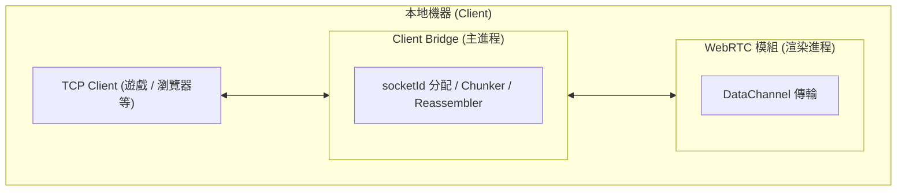
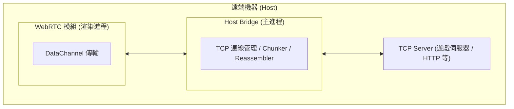
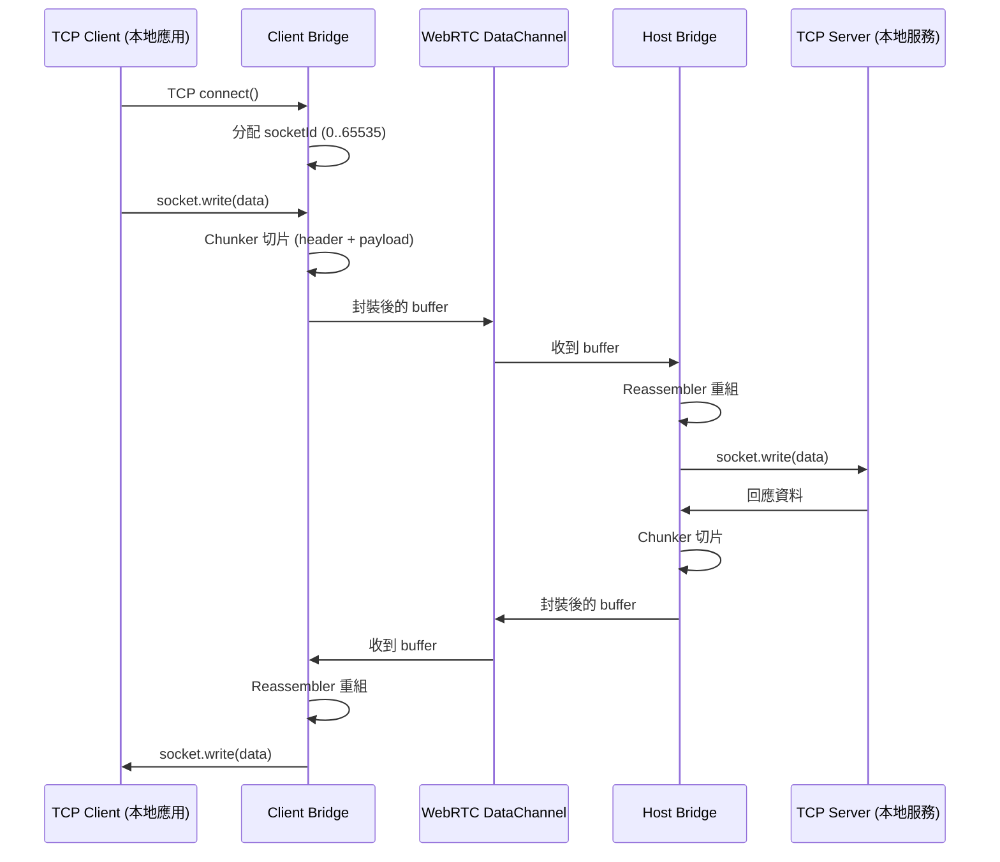
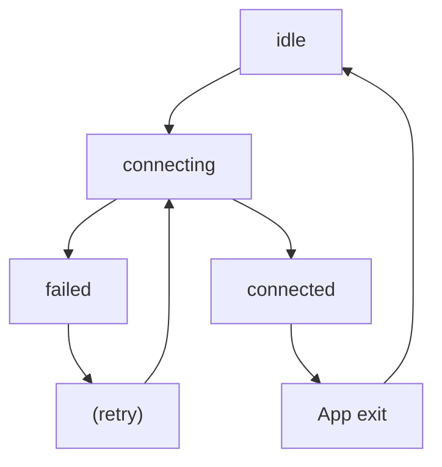
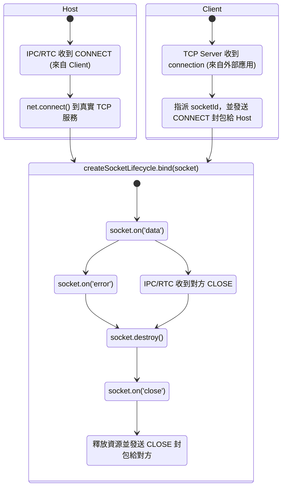

# 1ureka P2P 橋接工具

## 專案概述

這是一個基於 Electron 的桌面應用程式，能將 **TCP socket 與 WebRTC DataChannel** 做橋接，讓 **任何基於 TCP 的服務** 都能進行真正的點對點通訊。

本專案的願景是：**只要協定建立在 TCP 之上，就能透過本工具進行 P2P 傳輸。**
無論是 **多 socket 協定、server-first / client-first 連線、HTTP/HTTPS、WebSocket (ws/wss)，甚至 各種遊戲或自訂協定**，理論上都能透明橋接，因為工具專注在 TCP 層，不干涉更上層的協定。

<!-- 之後轉為 public repo 時再取消註解 -->
<!-- 這是一個正在實驗中的計畫，目前仍需要更多的協定測試與使用案例。
如果你也曾被防火牆、中心化伺服器或收費方案限制過，或單純想探索 TCP 與 WebRTC 的可能性，**歡迎參與與貢獻！** -->

### 核心功能

1. **Host 模式 (服務提供者)**：
   - 將任意本地 TCP 服務（如遊戲伺服器、HTTP 伺服器等）透過 WebRTC 暴露給遠端客戶端
   - 管理多個並發 TCP 連線
   - 支援連線監控與狀態回報

2. **Client 模式 (服務使用者)**：
   - 在本地建立假 TCP 伺服器，接受本地應用程式連線
   - 假 TCP 伺服器將本地應用程式的 TCP 連線透過 WebRTC 轉發到遠端 Host
   - 支援多個本地應用程式同時連線

## 架構設計





本工具採用 **雙進程架構**，透過 Electron 的 IPC 機制實現 TCP 與 WebRTC 之間的數據橋接，各自負責不同的網路層級處理：

### WebRTC 模組 (渲染進程)

負責 P2P 連線的建立與數據傳輸。特別利用 **Electron 的跨平台特性**，讓 WebRTC API 能在桌面環境下穩定運行，省去自行安裝 WebRTC 依賴的麻煩。主要功能包括：

- **信令交換**
  透過中央信令伺服器 (1ureka.vercel.app) 交換 SDP offer/answer 和 ICE candidates
- **IPC 橋接**
  監聽來自主進程的 `bridge.data.tcp` 事件，並將接收到的 WebRTC 數據透過 `bridge.data.rtc` 事件轉發給主進程
- **數據緩衝**
  透過實作內部佇列和緩衝區監控，確保在 DataChannel 緩衝區滿時不會因為阻塞而導致速度變慢

### Bridge 模組 (主進程)

負責 TCP 與 WebRTC 之間的數據轉換與傳輸，負責：

- **連線管理**
  Client 接收到新的 TCP 連線請求時，會為其分配唯一的 `socketId` ，並傳送 `CONNECT` 封包通知 Host 建立對應的 socket 連線
- **數據轉發**
  將來自 WebRTC 的 `DATA` 封包解包後寫入對應的 TCP socket
- **生命週期追蹤**
  監聽 TCP socket 的 `error`、`data`、`close` 事件，傳送 `DATA` 或 `CLOSE` 封包給對端
- **資源管理**
  當 socket 自身發生 `error` 或 `close` 時，會自動釋放相關資源，對端則會因為收到 `CLOSE` 封包而釋放對應資源

所有模組透過 **Electron IPC** 和 **自訂封包格式** 協同工作，實現完整的 TCP over WebRTC 隧道，讓兩端的傳統 TCP 應用程式能夠透過 P2P 網路進行通信。

### 流程圖

以下是單次 TCP 請求從本地應用程式到本地服務器的數據流向：



## 封包設計

在 **TCP over WebRTC** 的橋接中，為了支援多 socket、多訊息，以及避免因訊息過大導致傳輸失敗，實作了一個 **自訂 Header + Chunker 機制**。

- **Header**：提供必要的中繼資訊（socket 分流、訊息標識、事件型別）。
- **Chunker**：將一個完整訊息切成多個片段 (chunk)，每個片段攜帶 Header，確保在對端能正確重組。

### 結構

```
Offset   Size   Field          Type      說明
────────────────────────────────────────────────────────────
[0]      1      event          Uint8     DATA, CONNECT, CLOSE 事件
[1–2]    2      socket_id      Uint16    對應一條 TCP socket 連線
                                         (真的有數萬條連線 DataChannel 也不可能負荷，因此範圍足夠)
[3–4]    2      chunk_id       Uint16    一次完整訊息的唯一識別
                                         (WebRTC ordered=true 不太可能同時多個 chunk 未組完，因此範圍足夠)
[5–6]    2      chunk_index    Uint16    本片段序號
[7–8]    2      total_chunks   Uint16    總片段數
                                         (65535 片段 * 65525 bytes = ~4GB)
[9–10]   2      payload_size   Uint16    本片段大小 (bytes) (0–65535 > payload 最大 65525)
[11– ]   N      payload        Uint8[]   真正的資料內容
```

## 生命週期與資源管理

核心函數 `createHostBridge`, `createClientBridge`, `createWebRTC` 並未提供顯式的 `close()` 或 `clean()` API，原因是 **核心功能的生命週期與應用程式本身綁定**：

- 一旦進入 `connected` 狀態，該層就會持續存在，直到 Electron App 被關閉。
- 使用者若要斷開連線，只需關閉整個應用程式，所有資源會隨進程自動釋放。

然而，在 **進入 `connected` 之前** 的階段（`connecting` → `failed`），以及連線中的 sockets 管理，仍然會進行資源釋放，以避免資源洩漏或殘留。

### WebRTC, Bridge 生命週期



### Socket 生命週期



## WebRTC 架構

在實作上，WebRTC 的連線過程分散於許多步驟：建立 `RTCPeerConnection`、建立唯一的 `RTCDataChannel`、收集與設置 ICE Candidate、設置遠端描述等等。
為了讓生命週期清楚，專案封裝了一個 **唯一連線的 Session API**：

```ts
const { getDataChannel, getLocal, setRemote, close } = createWebRTCSession();
```

> 這層 Session 封裝會在一開始就初始化 **DataChannel** 與 **ICE Candidate 收集**，避免使用者忘記步驟。
> 其責任是確保 **唯一的 WebRTC 連線生命週期**，上層只需要專注於角色（Host/Client）的流程。

### 插件式綁定（bindXXX）規範

在 WebRTC 模組中，常見的操作如 **DataChannel ↔ IPC 綁定**、**監控流量**、**記錄監控資訊**，都可以被抽象為「插件」。
為了確保生命週期清晰，每個 `bindXXX` 函數必須遵循以下規範：

- **自給自足**：
  呼叫 `bindXXX(...)` 即表示完成了該插件的整個註冊過程。呼叫者無需額外呼叫 `unregister` 或 `close`。
- **責任範圍**：
  - `register` → 在 `onmessage`、`monkey patch send` 等事件中掛載需要的邏輯。
  - `unregister` → 必須在 `onclose` / `onerror` 自動移除監聽器、釋放自己創建的資源。

- **框架保證**：
  核心 `createWebRTCSession` 已經保證整體連線的 **主生命週期**，插件只需管理「自己多出來的部分」。
- **類似 Blender 插件機制**：
  - Blender 規範每個插件必須有 `register/unregister`。
  - 在這裡，`bindXXX` 就是自帶 register/unregister 的函式，應用本身不需要知道如何清理。

### 範例：DataChannel 與 IPC 綁定

```ts
const bindDataChannelIPC = (dataChannel: RTCDataChannel) => {
  const sender = createDataChannelSender(dataChannel);

  // register
  dataChannel.onmessage = (event) => /* ...轉發到 IPC... */;
  const handleIPCMessage = (buffer: unknown) => /* ...轉發到 DataChannel... */;
  window.electron.on("bridge.data.tcp", handleIPCMessage);

  // unregister
  dataChannel.onclose = () => {
    window.electron.off("bridge.data.tcp", handleIPCMessage);
    sender.close();
  };
  dataChannel.onerror = () => {
    window.electron.off("bridge.data.tcp", handleIPCMessage);
    sender.close();
  };
};
```

### 範例：DataChannel 流量監控

```ts
const bindDataChannelMonitor = (dataChannel, onUpdate) => {
  // register
  dataChannel.addEventListener("message", (e) =>  /* 計算輸入流量 */ );
  const originalSend = dataChannel.send.bind(dataChannel);
  dataChannel.send = (data) =>  /* 計算輸出流量 */, originalSend(data);

  // unregister
  const cleanup = () => { dataChannel.send = originalSend; /* 移除監聽 */ };
  dataChannel.addEventListener("close", cleanup);
  dataChannel.addEventListener("error", cleanup);
};
```
