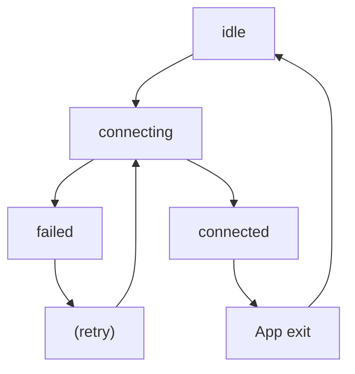
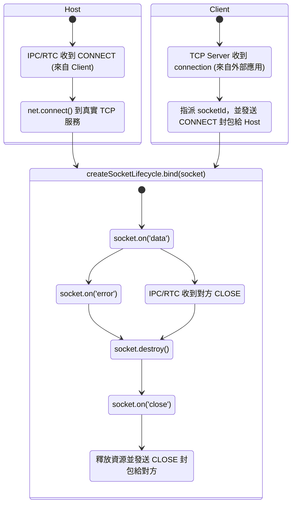

# 1ureka P2P 橋接工具

## 專案概述

1ureka P2P 橋接工具是一個基於 Electron 的桌面應用程式，主要功能是在兩個對等端之間建立 WebRTC 連接，並提供 TCP 與 WebRTC 之間的數據橋接服務，使傳統的基於 TCP 的應用程式能夠透過 P2P 網路進行通信。

## 架構設計

<!-- TODO -->

TODO

## 封包設計

### 背景

在 **TCP over WebRTC** 的橋接中，為了支援多 socket、多訊息，以及避免因訊息過大導致傳輸失敗，實作了一個 **自訂 Header + Chunker 機制**。

- **Header**：提供必要的中繼資訊（socket 分流、訊息標識、事件型別）。
- **Chunker**：將一個完整訊息切成多個片段 (chunk)，每個片段攜帶 Header，確保在對端能正確重組。

### 結構

```
Offset   Size   Field          Type      說明
────────────────────────────────────────────────────────────
[0]      1      event          Uint8     DATA, CONNECT, CLOSE 事件
[1–2]    2      socket_id      Uint16    對應一條 TCP socket 連線
                                         (真的有數萬條連線 DataChannel 也不可能負荷，因此範圍足夠)
[3–4]    2      chunk_id       Uint16    一次完整訊息的唯一識別
                                         (WebRTC ordered=true 不太可能同時多個 chunk 未組完，因此範圍足夠)
[5–6]    2      chunk_index    Uint16    本片段序號
[7–8]    2      total_chunks   Uint16    總片段數
                                         (65535 片段 * 65525 bytes = ~4GB)
[9–10]   2      payload_size   Uint16    本片段大小 (bytes) (0–65535 > payload 最大 65525)
[11– ]   N      payload        Uint8[]   真正的資料內容
```

## 生命週期與資源管理

核心函數 `createHostBridge` 與 `createClientBridge` 並未提供顯式的 `close()` 或 `clean()` API，原因是 **Bridge 的生命週期與應用程式本身綁定**：

- 一旦進入 `connected` 狀態，Bridge 就會持續存在，直到 Electron App 被關閉。
- 使用者若要斷開連線，只需關閉整個應用程式，所有資源會隨進程自動釋放。

然而，在 **進入 `connected` 之前** 的階段（`connecting` → `failed`），仍然會進行資源釋放，以避免資源洩漏或殘留。

### Bridge 生命週期



### Socket 生命週期


