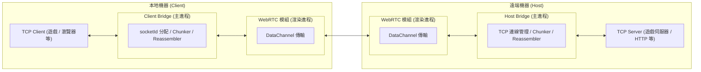
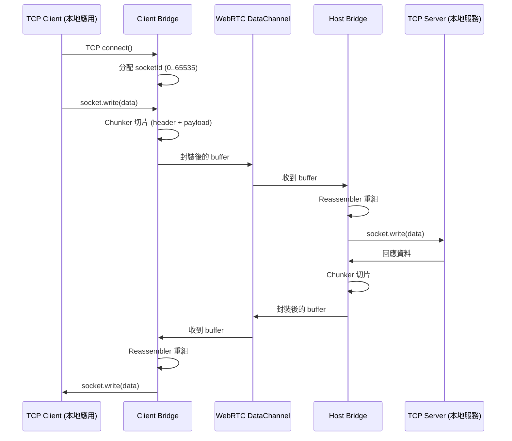
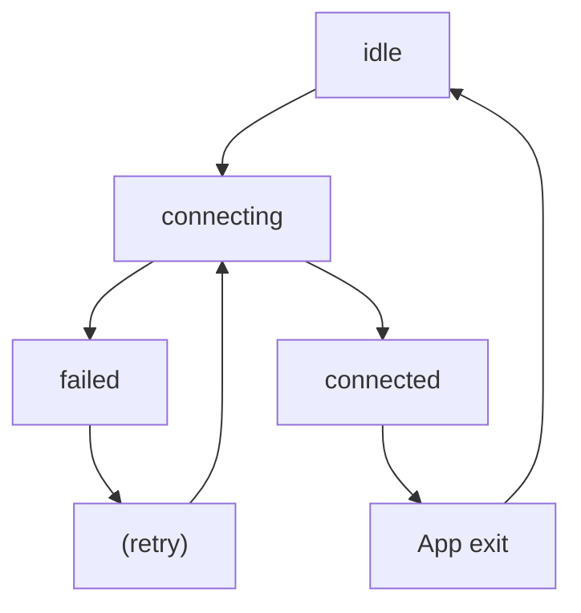
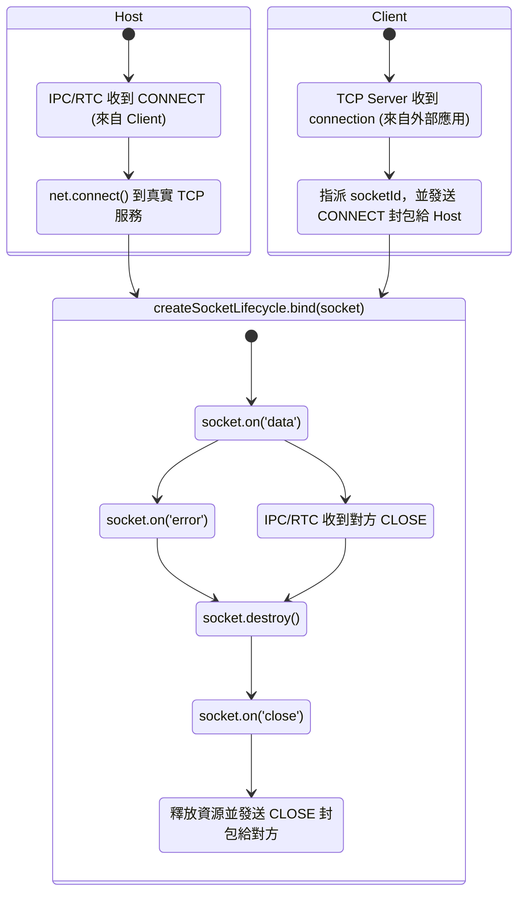

# 1ureka P2P 橋接工具

## 專案概述

1ureka P2P 橋接工具是一個基於 Electron 的桌面應用程式，主要功能是在兩個對等端之間建立 WebRTC 連接，並提供 TCP 與 WebRTC 之間的數據橋接服務，使傳統的基於 TCP 的應用程式能夠透過 P2P 網路進行通信。

## 架構設計



本工具採用 **雙進程架構**，透過 Electron 的 IPC 機制實現 TCP 與 WebRTC 之間的數據橋接，各自負責不同的網路層級處理：

### WebRTC 模組 (渲染進程)

負責 P2P 連線的建立與數據傳輸。特別利用 **Electron 的跨平台特性**，讓 WebRTC API 能在桌面環境下穩定運行，省去自行安裝 WebRTC 依賴的麻煩。主要功能包括：

- **信令交換**：透過中央信令伺服器 (1ureka.vercel.app) 交換 SDP offer/answer 和 ICE candidates
- **IPC 橋接**：監聽來自主進程的 `bridge.data.tcp` 事件，並將接收到的 WebRTC 數據透過 `bridge.data.rtc` 事件轉發給主進程

### Bridge 模組 (主進程)

負責 TCP 與 WebRTC 之間的數據轉換與傳輸，負責：

- **數據轉發**
  將來自 WebRTC 的 `DATA` 封包解包後寫入對應的 TCP socket
- **生命週期追蹤**
  監聽 TCP socket 的 `error`、`data`、`close` 事件，並透過自製封包格式通知對端

根據應用場景分為兩個子模組：

- **Client Bridge**
  建立一個**假的 TCP 服務**讓本地應用程式連接，會為每個新連線分配唯一的 `socketId` ，並呼叫 `CONNECT` 封包通知 Host 建立對應的 socket 連線
- **Host Bridge**
  負責連接到本地**真實的 TCP 服務**。當接收到來自 Client 的連線請求時，建立新的對應 TCP socket 連線到指定 port

所有模組透過 **Electron IPC** 和 **自訂封包格式** 協同工作，實現完整的 TCP over WebRTC 隧道，讓兩端的傳統 TCP 應用程式能夠透過 P2P 網路進行通信。

### 單次往返



## 封包設計

在 **TCP over WebRTC** 的橋接中，為了支援多 socket、多訊息，以及避免因訊息過大導致傳輸失敗，實作了一個 **自訂 Header + Chunker 機制**。

- **Header**：提供必要的中繼資訊（socket 分流、訊息標識、事件型別）。
- **Chunker**：將一個完整訊息切成多個片段 (chunk)，每個片段攜帶 Header，確保在對端能正確重組。

### 結構

```
Offset   Size   Field          Type      說明
────────────────────────────────────────────────────────────
[0]      1      event          Uint8     DATA, CONNECT, CLOSE 事件
[1–2]    2      socket_id      Uint16    對應一條 TCP socket 連線
                                         (真的有數萬條連線 DataChannel 也不可能負荷，因此範圍足夠)
[3–4]    2      chunk_id       Uint16    一次完整訊息的唯一識別
                                         (WebRTC ordered=true 不太可能同時多個 chunk 未組完，因此範圍足夠)
[5–6]    2      chunk_index    Uint16    本片段序號
[7–8]    2      total_chunks   Uint16    總片段數
                                         (65535 片段 * 65525 bytes = ~4GB)
[9–10]   2      payload_size   Uint16    本片段大小 (bytes) (0–65535 > payload 最大 65525)
[11– ]   N      payload        Uint8[]   真正的資料內容
```

## 生命週期與資源管理

核心函數 `createHostBridge`, `createClientBridge`, `createWebRTC` 並未提供顯式的 `close()` 或 `clean()` API，原因是 **核心功能的生命週期與應用程式本身綁定**：

- 一旦進入 `connected` 狀態，該層就會持續存在，直到 Electron App 被關閉。
- 使用者若要斷開連線，只需關閉整個應用程式，所有資源會隨進程自動釋放。

然而，在 **進入 `connected` 之前** 的階段（`connecting` → `failed`），以及連線中的 sockets 管理，仍然會進行資源釋放，以避免資源洩漏或殘留。

### WebRTC, Bridge 生命週期



### Socket 生命週期


